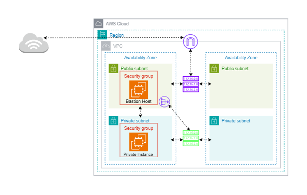

# AWS VPC & EC2 Terraform Infrastructure

## Table of Contents
- [Project Overview](#project-overview)
- [Architecture Diagram](#architecture-diagram)
- [Directory Structure](#directory-structure)
- [Module Descriptions](#module-descriptions)
- [Variables & Configuration](#variables--configuration)
- [How to Use](#how-to-use)
- [Security Best Practices](#security-best-practices)
- [References](#references)

---

## Project Overview
This repository provisions a secure, modular AWS VPC environment using Terraform. It includes:
- Custom VPC with DNS support
- Public and private subnets across AZs
- Internet Gateway, NAT Gateway, and route tables
- Bastion host for secure SSH access
- Private EC2 instances
- Security groups for public and private resources
- S3 buckets for VPC Flow Logs and EC2 data (with encryption, lifecycle, and access policies)
- VPC Flow Logs to S3
- IAM roles and instance profiles

---

## Architecture Diagram


## Directory Structure
```
VPC_EC2/
├── backend_s3.tf                # Remote backend config
├── main.tf                      # Main Terraform configuration
├── output.tf                    # Outputs for the root module
├── provider.tf                  # AWS provider configuration
├── README.md                    # Project documentation
└── modules/
    ├── bastion/                 # Bastion host module
    ├── internet_gateway/        # Internet Gateway module
    ├── keypair/                 # Key pair management
    ├── nat/                     # NAT Gateway module
    ├── private_ec2/             # Private EC2 instance module
    ├── private_security_group/  # Security group for private EC2
    ├── public_security_group/   # Security group for public EC2
    ├── routes_tables/           # Route tables module
    ├── s3/                      # S3 bucket module
    ├── subnets/                 # Subnets module
    ├── vpc/                     # VPC resource module
    └── vpc_flow/                # VPC Flow Logs
```

---

## Module Descriptions
- **vpc**: Provisions the main VPC with DNS support and hostnames.
- **subnets**: Creates public and private subnets using a list of maps (name, cidr, az).
- **routes_tables**: Configures route tables for public/private subnets.
- **internet_gateway**: Attaches an IGW to the VPC for public internet access.
- **nat**: Deploys a NAT Gateway for private subnet outbound access.
- **bastion**: Launches a bastion host for secure SSH access to private EC2s.
- **keypair**: Imports or creates an SSH key pair for EC2 access.
- **private_ec2**: Launches EC2 instances in private subnets, using latest Ubuntu AMI.
- **private_security_group**: Restricts access to private EC2s (e.g., only from bastion).
- **public_security_group**: Security group for public-facing resources.
- **s3**: Creates S3 buckets for VPC Flow Logs and EC2 data, with encryption, lifecycle, and IAM policies.
- **vpc_flow**: Enables VPC Flow Logs to S3, with IAM roles and log groups.

---

## Variables & Configuration

### Key Variables by Module
- **vpc**: `cidr_block`, `enable_dns_support`, `enable_dns_hostnames`, `name`
- **subnets**: `vpc_id`, `map_public_ip_on_launch`, `subnets`
- **private_ec2**: `private_subnet_id`, `name`, `instance_type`, `vpc_id`, `security_group_id`, `ssh_allowed_cidr_blocks`
- **private_security_group**: `name`, `description`, `vpc_id`, `ingress_rules`, `egress_rules`, `tags`
- **s3**: `vpc_flow_logs_bucket_name`, `ec2_data_bucket_name`, `name_flow_log_role`
- **vpc_flow**: `log_destination`, `vpc_id`

---

## How to Use
1. **Clone the repository**
   ```sh
   git clone https://github.com/protechanalysis/Aws-VPC-EC2.git
   cd terraform
   ```
2. **Configure AWS credentials**
   - Use `aws configure` or set environment variables (`AWS_ACCESS_KEY_ID`, `AWS_SECRET_ACCESS_KEY`)
3. **Initialize Terraform**
   ```sh
   terraform init
   ```
4. **Review and edit variables**
   - Edit variables in `main.tf` 
5. **Plan the deployment**
   ```sh
   terraform plan
   ```
6. **Apply the configuration**
   ```sh
   terraform apply
   ```
7. **Destroy resources (when finished)**
   ```sh
   terraform destroy
   ```

---

## Security Best Practices
- **Never commit AWS credentials or sensitive `.tfvars` files to version control.**
- Use IAM roles and least-privilege policies for automation.
- Restrict security group ingress to only necessary sources (e.g., SSH only from bastion or your IP).
- Enable S3 bucket encryption and lifecycle policies for log management.
- Use remote state (e.g., S3 backend) with state locking for team environments.
---

## References
- [Terraform AWS Provider Docs](https://registry.terraform.io/providers/hashicorp/aws/latest/docs)
- [AWS VPC Documentation](https://docs.aws.amazon.com/vpc/latest/userguide/)
- [Terraform Best Practices](https://www.terraform.io/language/best-practices)
